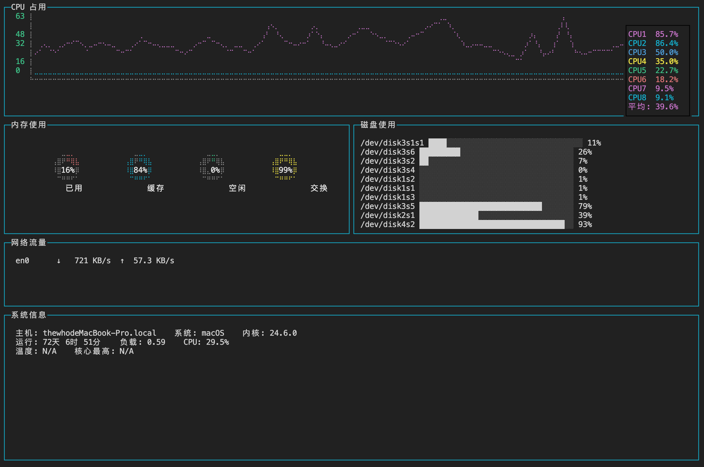

# CLI 系统监控仪表盘

终端（命令行）实时系统监控面板，仿 `htop`/`glances` 风格。

## 功能

| 面板 | 数据源 | 刷新间隔 | 说明 |
|------|--------|----------|------|
| CPU | `si.currentLoad()` | 1s | 折线图，每核心 + 平均值 |
| 内存 | `si.mem()` | 1s | 4 个环形图：已用/缓存/空闲/交换 |
| 磁盘 | `si.fsSize()` | 2s | 水平文字条，█/░ 表示已用/空闲 |
| 网络 | `si.networkStats()` | 2s | 各网卡实时 ↓/↑ 吞吐量 |
| 系统信息 | `si.osInfo/si.time/si.currentLoad/si.cpuTemperature` | 2s | 主机/系统/内核/运行时间/负载/温度 |

## 安装

```bash
git clone git@github.com:chenthewho/cli-system-dashboard.git
cd cli-system-dashboard
npm install
npm run build   # 或 npx tsc
```

## 运行

```bash
node dist/index.js
```

按 `Ctrl+C` 退出。

## 布局

```
┌────────────── CPU 折线图 (3行×12列) ──────────────┐
│  内存环形图 (3×6)        │  磁盘文字条 (3×6)      │
│  网络流量 (2×12)                                  │
│  系统信息 (4×12)                                  │
└───────────────────────────────────────────────────┘
```

## 截图



## 技术栈

- [blessed](https://github.com/chjj/blessed) — 终端 UI 框架
- [blessed-contrib](https://github.com/yaronn/blessed-contrib) — 仪表盘组件（折线图、环形图）
- [systeminformation](https://github.com/sebhildebrandt/systeminformation) — 系统信息采集
- TypeScript

## 项目结构

```
src/
├── index.ts              # 主入口，布局和面板集成
└── monitor/
    ├── cpu.ts            # CPU 监控（折线图）
    ├── memory.ts         # 内存监控（环形图 ×4）
    ├── disk.ts           # 磁盘监控（文字水平条）
    ├── network.ts        # 网络监控（文字速率）
    └── system.ts         # 系统信息（文字面板）
```

## License

MIT
